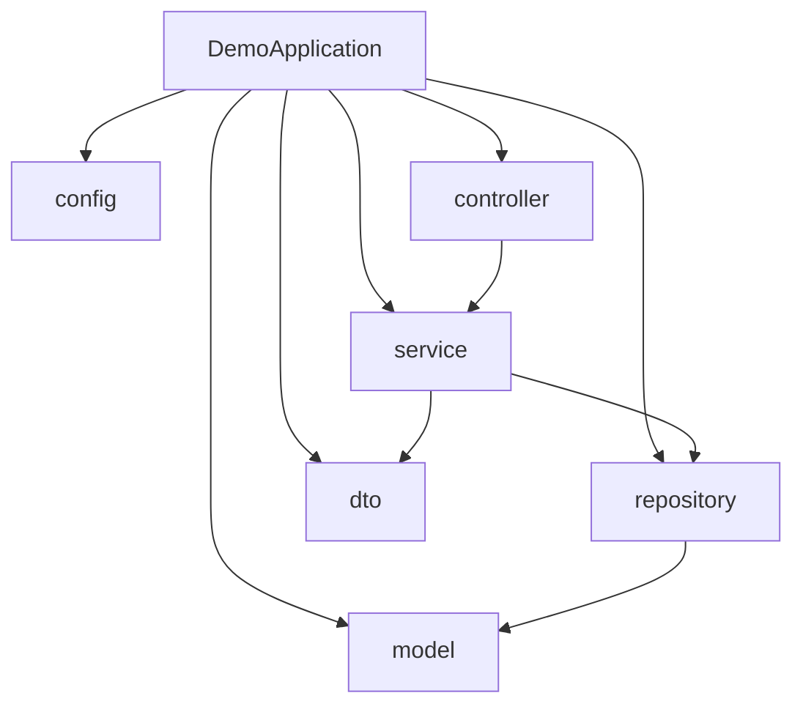
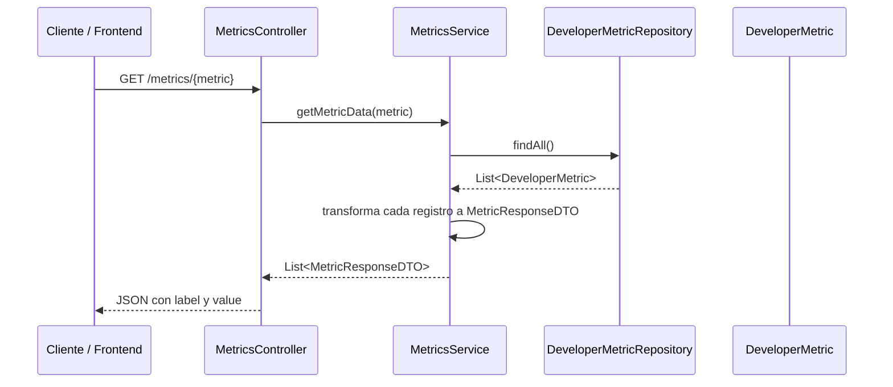

# Frontend de la aplicación

## 1. Estructura de carpetas
Dashboard es el componente que se encarga de cargar todos los datos provenientes del backend y de renderizar las gráficas y todos los componentes. En la carpeta services se encuentra metricsService, el cual se encarga de realizar las solicitudes de datos al backend y proporcionar la información necesaria mediante la función getMetricData().

## 2. Componentes principales
Hay 4 secciones, Total commits, Promedio diario, Máximo y la gráfica que muestra la evolución de los commits. Las primeras tres muestran métricas calculadas a partir de los datos obtenidos de la API mediante componentes MetricCard. La última sección utiliza Chart.js para representar visualmente el comportamiento de los commits a lo largo del tiempo, facilitando el análisis de tendencias.

## 3. Manejo del estado con Hooks
Para el manejo de los estados, se utiliza useEffect() para cargar todos los datos de los commits solicitados de la base de datos una sola vez. Y useState para almacenar estos datos desde la API.

## 4. Consumo de APIs
El consumo de la API se realiza importando getMetricData desde el archivo metricsService, el cual está en la carpeta services. Este tiene la función getmetricData(), encargada de realizar la solicitud de información al backend y devolver los datos requeridos. Posteriormente, estos datos son almacenados en el estado mediante setData(result) para que puedan ser utilizados en el cálculo de métricas y la generación de la gráfica.

## 5. Flujo de datos entre componentes
El flujo de datos en el frontend empezaría con la API, que mandaría los datos solicitados al dashboard, este se encargaría de transformarlos, hacer los cálculos solicitados y finalmente desplegarlos.

## 6. Implementación de gráficas o visualizaciones
La aplicación utiliza Chart.js junto con react-chartjs-2 para generar una gráfica de líneas que muestra la evolución de los commits a lo largo del tiempo. Los datos de la gráfica se construyen dinámicamente a partir de la información obtenida de la API, utilizando las etiquetas como eje horizontal y los valores como eje vertical. Esta visualización permite identificar tendencias y cambios en la actividad de manera más clara y sencilla.

## 7. Identificación de posibles mejoras
El problema más grande que existe actualmente y que mejoraría considerablemente el rendimiento solucionarlo, es que actualmente para cada render se recalculan todos los datos, esto se podría solucionar fácilmente utilizando un useMemo().
En cuestión de visuales, los colores están muy mal implementados porque muchos elementos tales como algunos títulos y datos se pierden en el fondo. Además de que se podría agregar más descripciones para los datos mostrados para dar aun más contexto.

# Backend de la aplicación

## 1. Estructura general del proyecto
El backend está construido con Spring Boot y sigue una organización por capas dentro del paquete `com.exampleback.demo`.

La estructura actual es la siguiente:

- `DemoApplication.java`: punto de entrada de Spring Boot.
- `config/`: configuración transversal de la aplicación, principalmente seguridad y CORS.
- `controller/`: expone los endpoints HTTP.
- `service/`: contiene la lógica de negocio y la transformación de datos.
- `repository/`: proporciona el acceso a los datos.
- `model/`: define el modelo de datos interno.
- `dto/`: define los objetos que viajan entre capas y hacia el frontend.

## 2. Función de las capas

### Controller
La capa `controller` recibe las peticiones HTTP y las delega al servicio correspondiente. En este proyecto, `MetricsController` expone el endpoint `GET /metrics/{metric}` y devuelve una lista de métricas ya transformadas para el frontend.

### Service
La capa `service` concentra la lógica de negocio. `MetricsService` obtiene todos los registros desde el repository, selecciona el campo correcto según el parámetro `metric` y construye una lista de `MetricResponseDTO` con la forma esperada por la interfaz.

### Repository
La capa `repository` actúa como fuente de datos. En esta implementación no existe una base de datos conectada; `DeveloperMetricRepository` devuelve una lista fija de objetos `DeveloperMetric` en memoria. Esto simula el acceso a datos y permite que el resto de la arquitectura se mantenga igual que en una aplicación con persistencia real.

### DTO
Los DTO (Data Transfer Objects) se usan para desacoplar el modelo interno de la salida de la API. Aquí `MetricResponseDTO` contiene solo `label` y `value`, que son los campos que necesita el frontend para pintar la gráfica y las tarjetas.

### Model/Entity
La clase `DeveloperMetric` representa la estructura interna del dato. Contiene el nombre del desarrollador, la fecha de la métrica y los contadores de commits, bugs solucionados, tareas completadas y story points. En un escenario con base de datos, esta clase normalmente sería una entidad JPA.

## 3. Flujo de una petición desde el cliente hasta la base de datos
El recorrido de una petición es lineal y sigue la arquitectura por capas.

En términos prácticos, el frontend solicita una métrica concreta como `commits`, `bugs`, `tasks` o `storyPoints`. El controller recibe esa solicitud, el service consulta los datos del repository y convierte cada registro en un DTO listo para ser consumido por la interfaz. Actualmente no hay una base de datos real detrás del repository, pero el flujo sería el mismo si se sustituyera por una implementación JPA.

## 4. Configuración de seguridad y CORS
La configuración de seguridad está en `SecurityConfig`. La aplicación:

- desactiva CSRF;
- habilita CORS con la configuración global;
- permite cualquier petición con `permitAll()`.

Esto significa que la API está preparada para consumo desde el frontend sin autenticación obligatoria en este momento.

La configuración CORS está en `CorsConfig` y permite:

- origen `http://localhost:5173`, que corresponde al frontend en desarrollo;
- métodos `GET`, `POST`, `PUT`, `DELETE` y `OPTIONS`;
- cualquier cabecera;
- envío de credenciales.

Esta configuración evita bloqueos del navegador cuando el frontend y el backend se ejecutan en puertos distintos.

## 5. Identificación de posibles mejoras
El backend funciona correctamente para un prototipo, pero tiene varias oportunidades de mejora:

- Sustituir el repository en memoria por una base de datos real con JPA y una entidad persistente.
- Eliminar la clase duplicada `MetricResponseDTO` que existe tanto en `dto/` como en `repository/`.
- Reemplazar el `switch` del service por una estrategia más extensible, por ejemplo un mapa de mapeo de métricas.
- Validar el parámetro `metric` para devolver errores claros cuando llegue un valor no soportado.
- Añadir manejo centralizado de excepciones con respuestas HTTP coherentes.
- Introducir autenticación real si la API va a exponerse fuera de un entorno de desarrollo.
- Separar los datos de prueba en una fuente dedicada o en fixtures para evitar que el repository parezca una capa de persistencia real.